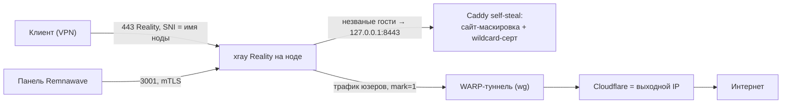

# 📘 RemnaSetup — Справочник

Полное руководство по инфраструктуре Reality-нод: как устроено, как разворачивать,
как чинить и как защищаться от банов. Держи открытым — сюда удобно возвращаться.

---

## Оглавление

- [1. Как это устроено](#1-как-это-устроено)
- [2. Разовая подготовка (Cloudflare + мастер-серт)](#2-разовая-подготовка-cloudflare--мастер-серт)
- [3. Установка новой ноды](#3-установка-новой-ноды)
- [4. Перевод старой ноды на новую схему](#4-перевод-старой-ноды-на-новую-схему)
- [5. Настройка профиля в Remnawave](#5-настройка-профиля-в-remnawave)
- [6. 🔧 Диагностика: «что делать если…»](#6--диагностика-что-делать-если)
- [7. ⚠️ Грабли и тонкости](#7-️-грабли-и-тонкости)
- [8. 🛡️ Защита от банов (слои)](#8-️-защита-от-банов-слои)
- [9. Шпаргалка команд](#9-шпаргалка-команд)
- [10. Ротация при бане IP / утечке имени](#10-ротация-при-бане-ip--утечке-имени)

---

## 1. Как это устроено



| Компонент | Роль |
|---|---|
| **xray Reality** (443) | принимает клиентов; «незваных» проксирует на локальный Caddy (self-steal) |
| **Caddy** (8443) | отдаёт сайт-маскировку и **валидный TLS**, у которого Reality «крадёт» хендшейк |
| **Wildcard-серт** `*.домен` | один серт на все ноды; в CT-логах не светятся имена нод |
| **WARP** | egress ноды = Cloudflare; реальный IP ноды не виден как выход |
| **ufw + fail2ban** | фаервол (панель к портам управления, 8443 закрыт) + защита SSH |
| **Панель Remnawave** | управляет нодами по mTLS на `3001`; хранит конфиги/ключи/подписки |

**Ключевая идея:** вход (нода:443) прячем от обнаружения (decoy + wildcard), выход прячем за
Cloudflare (WARP). Но датацентровый IP входа всё равно можно забанить подсетью → нужна **ротация**.

---

## 2. Разовая подготовка (Cloudflare + мастер-серт)

### 2.1. Домен на Cloudflare
1. Cloudflare → *Add a Site* → домен → тариф **Free**.
2. У регистратора сменить **NS** на выданные Cloudflare. Проверка: `dig NS домен` → NS Cloudflare.
3. API-токен: *My Profile → API Tokens → Create Custom Token* →
   **Permissions:** `Zone → DNS → Edit`, **Zone Resources:** `Include → Specific zone → домен`.

### 2.2. Выпустить wildcard ОДИН раз («cert master»)
На одной ноде с рабочим Cloudflare-доступом:
```bash
DOMAIN=master.домен CF_API_TOKEN='токен' MONITOR_PORT=8443 \
bash <(curl -fsSL https://raw.githubusercontent.com/proqopev/RemnaSetup/refs/heads/main/install.sh) install-caddy-node
```
Дождись `certificate obtained successfully` (`journalctl -u caddy -f`).

### 2.3. Забрать файлы серта (WinSCP)
Из `/var/lib/caddy/.local/share/caddy/certificates/acme-v02.api.letsencrypt.org-directory/wildcard_.домен/`
скачай два файла и переименуй у себя:
- `wildcard_.домен.crt` → **`wildcard.crt`**
- `wildcard_.домен.key` → **`wildcard.key`**

> ⚠️ **Лимит Let's Encrypt: 5 сертов на `*.домен` за 7 дней.** Поэтому выпускаем ОДИН раз,
> дальше только **раздаём файлы**. На нодах ACME больше не трогаем.

### 2.4. Массовая раскатка серта на все ноды (автоматически)

Если ноды прописаны в `~/.ssh/config` (вход по имени, ключом), используй
[`tools/deploy-cert.sh`](../tools/deploy-cert.sh) — он по SSH зальёт `wildcard.crt`/`wildcard.key`
на каждую ноду и переключит Caddy на них (`import-cert`, без ACME). Запуск из Git Bash на Windows.

```bash
# положи wildcard.crt и wildcard.key рядом со скриптом, затем:

# на все хосты из ~/.ssh/config:
./tools/deploy-cert.sh -d datahubfiles.com --from-ssh-config

# или на конкретные:
./tools/deploy-cert.sh -d datahubfiles.com node1 node2 node3

# или из файла со списком:
./tools/deploy-cert.sh -d datahubfiles.com -f hosts.txt
```
Опции: `-c/-k` — пути к серту/ключу, `-p` — MONITOR_PORT (8443), `-u` — ssh-юзер, `-y` — без подтверждения.

**Этот же скрипт = renewal:** перевыпустил `*.домен` на мастере → скачал новые `wildcard.crt/key` →
прогнал `deploy-cert.sh` ещё раз → серт обновился на всех нодах. Можно повесить на расписание.

> Работает по **уже установленным** нодам (где Caddy стоит). Для свежих нод серт ставится сразу
> при установке через `WILDCARD_CRT/KEY` (см. [раздел 3](#3-установка-новой-ноды)).

---

## 3. Установка новой ноды

1. **Cloudflare A-запись:** случайное имя (напр. `x7f2qk9z`) → IP ноды, **Proxy: DNS only (серая тучка).**
2. **Проверь IP на чистоту (до установки!):** check-host.net → *TCP connect* на `IP:443` из Москвы/СПб.
   Красные РФ-точки → IP уже в бане, **не бери**.
3. **WinSCP:** залей `wildcard.crt` и `wildcard.key` в `/root/`.
4. **Установка одной командой:**
```bash
NON_INTERACTIVE=true \
DOMAIN=x7f2qk9z.домен \
WILDCARD_CRT=/root/wildcard.crt WILDCARD_KEY=/root/wildcard.key \
MONITOR_PORT=8443 NODE_PORT=3001 SECRET_KEY='ключ_из_панели' \
NODE_VERSION=3.2.2 \
WEBSERVER=caddy INSTALL_WARP=y BBR_ANSWER=y PANEL_IP=IP_ПАНЕЛИ \
bash <(curl -fsSL https://raw.githubusercontent.com/proqopev/RemnaSetup/refs/heads/main/install.sh) install-node
```
   При заданных `WILDCARD_CRT/KEY` Caddy берёт готовый серт (без ACME → лимит не тратится, имя в CT не светится).
   Интерактивно: положи серты в `/root` → скрипт сам спросит «использовать готовые серты?».
5. **Профиль в панели** (см. [раздел 5](#5-настройка-профиля-в-remnawave)).
6. **Переимпортируй подписки** (новый SNI).

---

## 4. Перевод старой ноды на новую схему

**Проще всего — пункт меню `10. Миграция` (или команда `migrate`).** Один заход переводит ноду
с изначальной установки (capybara) на новую схему: ставит **сайт-маскировку**, настраивает
**Caddy wildcard** (серты из `/root` без ACME, а если их нет — выпустит через Cloudflare, спросит токен)
и поднимает **WARP-egress** (ставит WARP если нет, или добавляет маршрутизацию). В конце — напоминание
по профилю. Перед запуском не забудь A-запись нового имени (DNS only) и, при желании, `wildcard.crt/key` в `/root`.

```bash
bash <(curl -fsSL https://raw.githubusercontent.com/proqopev/RemnaSetup/refs/heads/main/install.sh) migrate
```

Дальше в панели: `serverNames` (новое имя), `target: 127.0.0.1:8443`, WARP-outbound, и переимпорт подписок.

<details>
<summary>Или вручную по шагам</summary>

1. Cloudflare: A-запись нового случайного имени → IP ноды (**DNS only**).
2. WinSCP: `wildcard.crt` + `wildcard.key` в `/root/`.
3. Серт без ACME:
   ```bash
   bash <(curl -fsSL https://raw.githubusercontent.com/proqopev/RemnaSetup/refs/heads/main/install.sh) import-cert
   ```
4. WARP-egress (если ещё нет):
   ```bash
   bash <(curl -fsSL https://raw.githubusercontent.com/proqopev/RemnaSetup/refs/heads/main/install.sh) setup-warp-routing
   ```
5. Панель: обнови `serverNames` (новое имя), проверь `target: 127.0.0.1:8443`, добавь WARP-outbound.
6. Переимпортируй подписки.
</details>

---

## 5. Настройка профиля в Remnawave

Серверную часть ставит скрипт, **xray-конфиг в панели правится вручную.**

### Reality-инбаунд
- `target` → **`127.0.0.1:8443`** (не голое `"8443"`)
- `serverNames` → полное имя ноды (`x7f2qk9z.домен`), **не** wildcard
- `xver` → `0` для Caddy (`1` — для Nginx с proxy protocol)

### WARP-egress
```json
"dns": { "servers": ["https://1.1.1.1/dns-query"], "queryStrategy": "UseIPv4" }
```
```json
{ "tag": "warp", "protocol": "freedom",
  "settings": { "domainStrategy": "ForceIPv4" },
  "streamSettings": { "sockopt": { "mark": 1 } } }
```
```json
"routing": { "rules": [
  { "type":"field", "ip":["geoip:private"], "outboundTag":"BLOCK" },
  { "type":"field", "domain":["geosite:private"], "outboundTag":"BLOCK" },
  { "type":"field", "protocol":["bittorrent"], "outboundTag":"BLOCK" },
  { "type":"field", "network":"tcp,udp", "outboundTag":"warp" }
] }
```

**Проверка:** с клиента `https://www.cloudflare.com/cdn-cgi/trace` → `warp=on` + IP Cloudflare.

> ⚠️ Не применяй профиль с `outboundTag: warp` на ноду **без** настроенной host-части WARP
> (`setup-warp-routing`) — трафику некуда идти, клиенты уйдут в офлайн.

---

## 6. 🔧 Диагностика: «что делать если…»

<details>
<summary><b>Клиент вообще не подключается</b></summary>

1. **Достижим ли IP из твоей сети?** Зайди по SSH к ноде **без VPN**. Не идёт → IP заблокирован
   провайдером/РКН → это не конфиг, **меняй IP** (см. [раздел 10](#10-ротация-при-бане-ip--утечке-имени)).
2. **Серт на месте?** На ноде:
   `echo | openssl s_client -connect 127.0.0.1:8443 -servername имя.домен 2>/dev/null | openssl x509 -noout -subject`
   → должно быть `CN=*.домен`. Нет → залей серт (`import-cert`).
3. **`target` = `127.0.0.1:8443`?** `serverNames` = реальное имя?
4. **Подписку обновил** после смены домена? Старый SNI в кэше → хендшейк не сходится.
</details>

<details>
<summary><b>Подключается, но страницы не грузятся</b></summary>

Это **egress мёртв** (обычно WARP). На ноде:
```bash
wg show warp | grep -iE "handshake|transfer"   # свежий handshake, received > 0?
ip route get 1.1.1.1 mark 1                     # → dev warp?
curl --interface warp -s --max-time 8 https://ifconfig.me
```
- Нет handshake → туннель лёг (хостер режет UDP 2408 → смени `Endpoint` на `162.159.192.1:2408`/`:500`/`:4500`).
- Нет `dev warp` → нет маршрутизации → `setup-warp-routing`.
- **Быстрый тест:** в панели переключи ловушку на `DIRECT`. Пошло → точно WARP; висит → Reality/нода.
</details>

<details>
<summary><b>2ip / trace показывает НЕ Cloudflare</b></summary>

WARP-egress не работает. Проверь:
```bash
wg show warp                     # "No such device" → WARP не установлен → пункт меню 7
ip route get 1.1.1.1 mark 1      # → dev warp?
```
И в панели: реально ли есть `warp`-outbound + правило `network:tcp,udp → warp`?
Если трафик метится `mark 1`, но идёт через `ens18` → нет host-WARP → `setup-warp-routing`.
</details>

<details>
<summary><b>Панель видит ноду, но клиентов нет</b></summary>

Панель↔нода (`3001`) — отдельный слой от клиентов (`443`). Смотри `docker logs remnanode`.
Если `alert 40 / handshake failure` в логах панели → **рассинхрон SECRET_KEY** (ключ в контейнере
не от текущей карточки ноды). Пересоздай ноду в панели, вставь свежий `SECRET_KEY`, `docker compose up -d`.
Нюанс: панель может **регенерировать** серт при каждом просмотре — вставил ключ и **не открывай снова**.
</details>

<details>
<summary><b>Caddy не выпускает серт</b></summary>

Смотри `journalctl -u caddy | grep -iE "obtain|error|429|challenge"`.
- `429 rateLimited` → упёрся в **лимит LE** (5/нед). Не выпускай на каждой ноде — **раздавай готовый** (`import-cert`).
- `network is unreachable [IPv6]` → битый IPv6 → `sysctl -w net.ipv6.conf.all.disable_ipv6=1`.
- `operation not permitted / 127.0.0.53` → системный DNS/`unattended-upgrades`; обычно решается `import-cert` (ACME не нужен).
</details>

<details>
<summary><b>Имя ноды утекло в CT-логах (crt.sh / merklemap.com)</b></summary>

Проверять утечки: [crt.sh/?q=домен](https://crt.sh) или [merklemap.com](https://www.merklemap.com) — должно быть **только** `*.домен` (+апекс).

Появилось конкретное имя → нода выпустила серт на **своё имя** (старый конфиг `имя.домен:8443` вместо `*.домен`).
CT — вечный, имя **сожжено**: 1) переведи ноду на `import-cert` (Caddyfile → `*.домен`, ACME off);
2) **ротируй имя** ноды. Аудит всех нод:
`grep -oE '^\*?\.?[A-Za-z0-9.-]+:[0-9]+' /etc/caddy/Caddyfile | head -1` — должно быть `*.домен:8443`.
</details>

<details>
<summary><b>Установка WARP падает («не удалось установить WireGuard»)</b></summary>

Почти всегда **apt заблокирован** `unattended-upgrades`. Дождись:
```bash
while fuser /var/lib/dpkg/lock-frontend >/dev/null 2>&1; do echo "жду apt..."; sleep 3; done
```
или `systemctl stop unattended-upgrades; kill <pid>; dpkg --configure -a`. Затем повтори. Ребут тоже снимает лок.
</details>

---

## 7. ⚠️ Грабли и тонкости

| Тема | Суть |
|---|---|
| **Версии панель↔нода** | нода `3.3.x` не работает с панелью `2.7.x` (сменили handshake) → `NODE_VERSION=3.2.2`. Апгрейд: **сначала панель**, потом ноды. Не гоняй `docker compose pull` без пина. |
| **`target`** | `127.0.0.1:8443`, не голое `"8443"`. |
| **A-запись** | только **DNS only (серая тучка)**, иначе Reality не работает. |
| **Лимит LE** | 5 сертов/нед на `*.домен`. Выпусти раз → раздавай (`import-cert`). **Не переустанавливай ради серта.** |
| **CT-логи вечные** | утёкшее имя не удалить → ротировать. Все ноды — на wildcard/`import-cert`. |
| **IPv6 ломает ACME** | `network unreachable [IPv6]` → отключи IPv6 или используй готовый серт. |
| **apt-лок** | `unattended-upgrades` держит dpkg → установка падает. Ждать/снять лок/ребут. |
| **WireGuard** | ставить `wireguard-tools` (не метапакет с DKMS). |
| **PostUp** | только в секции `[Interface]` warp.conf (выше `[Peer]`), иначе wg-quick падает. |
| **WARP = точка отказа** | «всё через warp»: туннель лёг → нет интернета у клиентов. Следит watchdog; не вешай WARP-профиль на ноду без host-части. |
| **Пинг ≠ VPN** | РКН режет по протоколу/порту/SNI, ICMP проходит. Проверяй **TCP :443**, не пинг. |
| **Блок IP** | не идёт даже SSH из дома без VPN → весь IP забанен → **только замена**, конфиг не поможет. |
| **Подписки** | после смены домена **переимпортируй** (старый SNI в кэше = нет коннекта). |
| **`REMNASETUP_REPO`** | голая команда тянет твой форк `proqopev`; для чужого форка — `REMNASETUP_REPO=user/repo`. |
| **raw CDN-кэш** | после `git push` ~5 мин raw.githubusercontent может отдавать старое. |

---

## 8. 🛡️ Защита от банов (слои)

По приоритету воздействия:

1. **Диверсификация хостеров/ASN** + вет IP на чистоту до деплоя (банят подсетями; грязные IP — сразу мёртвые).
2. **Сегментация подписок** — не клади все ноды каждому юзеру; пулы + короткие токены + ревок. Утёкшая подписка не палит весь флот.
3. **CDN-fronted fallback** (VLESS+WS/XHTTP+TLS за оранжевой тучкой) — вход = IP Cloudflare, его не забанить пачкой. Живучий второй путь на случай бана Reality-IP.
4. **Авто-монитор банов** — раз в N минут проверять :443 из РФ → алерт → быстрая ротация (у нас дешёвая).
5. **Reality-тюнинг** — `fingerprint: chrome`; опционально `dest` на реальный крупный сайт; реалистичный 404/заголовки у decoy.
6. **Панель из РФ убрать** (риск изъятия = утечка всего) + **2FA** на панель/хостер/регистратор/Cloudflare.
7. **Гигиена** — не переиспользовать сожжённые IP/имена; случайные PTR без страны; раз в месяц проверять CT ([crt.sh](https://crt.sh) / [merklemap.com](https://www.merklemap.com) — должно быть только `*.домен`); запас чистых IP.

Ни один слой не даёт «неубиваемо». Реальная защита = decoy/wildcard/WARP (жить дольше) **+** быстрая ротация (быстро восстанавливаться).

### Реализация: два IP (чистый вход + расходный выход)

Если у ноды **два публичных IP** (dual-IP VPS) — WARP не нужен, вход/выход разносятся нативно и **быстрее**:
- **Вход = чистый IP** (A-запись + `serverNames`) — сюда коннектятся клиенты, он должен быть жив.
- **Выход = «расходный» IP** (можно уже забаненный) — egress с него. Бан в РФ **пофиг**: на него из РФ никто не коннектится, а к зарубежным сайтам он ходит нормально. Забанят совсем — просишь у хостера новый второй IP, вход не трогаешь.

**netplan** (оба IP на одном интерфейсе):
```yaml
network:
  version: 2
  ethernets:
    ens3:
      addresses:
        - 203.0.113.10/24     # чистый = ВХОД
        - 198.51.100.20/24       # расходный = ВЫХОД
      routes:
        - to: default
          via: 198.51.100.1
```

> ⚠️ **Куда пойдёт дефолтный выход — зависит от подсети шлюза.** Если шлюз (`via`) в подсети
> **расходного** IP — egress автоматом с него (удобно). Если шлюз в подсети **чистого** — дефолтный
> egress пойдёт с **входного** IP → **утечка**. Поэтому не полагайся на дефолт, **всегда проверяй**:
> ```bash
> curl -s ifconfig.me    # что реально уходит с ноды
> ```

**В панели** (профиль этой ноды): выход через `DIRECT`, и на нём **явно** задай расходный IP
через `sendThrough` — так egress детерминирован независимо от маршрутов:
```json
{ "tag": "DIRECT", "protocol": "freedom", "sendThrough": "198.51.100.20" }
```
(подставь **расходный** IP именно этой ноды — тот, что НЕ в панели). И в routing:
```json
{ "type":"field", "network":"tcp,udp", "outboundTag":"warp" }     // было
{ "type":"field", "network":"tcp,udp", "outboundTag":"DIRECT" }   // стало
```

> ⚠️ **`outboundTag` = ИМЯ (`tag`) outbound-а (`DIRECT`), а НЕ IP.** IP выхода пишется **только**
> в `sendThrough` внутри самого outbound-а. Не вставляй IP в `outboundTag` — routing будет
> ссылаться на несуществующий блок.

**Полный профиль (dual-IP, выход через расходный IP)** — заглушки замени на свои:

```json
{
  "log": { "loglevel": "none" },
  "dns": { "servers": ["https://1.1.1.1/dns-query"], "queryStrategy": "UseIPv4" },
  "inbounds": [
    {
      "tag": "vless-reality",
      "port": 443,
      "protocol": "vless",
      "settings": { "clients": [], "decryption": "none" },
      "sniffing": { "enabled": true, "destOverride": ["http", "tls", "quic"] },
      "streamSettings": {
        "network": "raw",
        "security": "reality",
        "realitySettings": {
          "show": false,
          "xver": 0,
          "target": "127.0.0.1:8443",
          "spiderX": "/",
          "shortIds": ["<short-id-из-панели>"],
          "privateKey": "<приватный-ключ-из-панели>",
          "fingerprint": "firefox",
          "serverNames": ["x7f2qk9z.example.com"]
        }
      }
    }
  ],
  "outbounds": [
    { "tag": "DIRECT", "protocol": "freedom", "sendThrough": "198.51.100.20" },
    { "tag": "BLOCK", "protocol": "blackhole" }
  ],
  "routing": {
    "rules": [
      { "type": "field", "ip": ["geoip:private"], "outboundTag": "BLOCK" },
      { "type": "field", "domain": ["geosite:private"], "outboundTag": "BLOCK" },
      { "type": "field", "protocol": ["bittorrent"], "outboundTag": "BLOCK" },
      { "type": "field", "network": "tcp,udp", "outboundTag": "DIRECT" }
    ]
  }
}
```

Что подставить:
- `198.51.100.20` — **расходный** (выходной) IP ноды (тот, что НЕ в панели);
- `x7f2qk9z.example.com` — имя ноды (вход; в Cloudflare A-запись этого имени → **чистый** IP, DNS only);
- `<приватный-ключ>` / `<short-id>` — из карточки ноды в панели;
- `warp`-outbound здесь **не нужен** (мы на два-IP). Для single-IP нод — наоборот, оставляй WARP-вариант из [раздела 5](#5-настройка-профиля-в-remnawave).
WARP-outbound можно оставить (метка станет неактивной) или убрать. Reality слушает `0.0.0.0:443`,
приём на чистом IP работает без изменений.

**На ноде** отключи WARP (туннель/маршрутизация/watchdog):
```bash
bash <(curl -fsSL https://raw.githubusercontent.com/proqopev/RemnaSetup/refs/heads/main/install.sh) disable-warp
```
(или меню → **11. Отключить WARP-egress**). После — трафик клиентов пойдёт через дефолт = расходный IP.

Проверка с клиента: `2ip` → показывает **расходный** IP (не Cloudflare и **не входной**).
Если показывает **входной** IP — выход палит вход: добавь `sendThrough: <расходный IP>` на `DIRECT` (см. выше) и перепроверь.

> ⚠️ `DIRECT`-выход годится **только для dual-IP** нод. На **single-IP** ноде он выпустит трафик
> с единственного (входного) IP → утечка входа. Там оставляй **WARP**.

**WARP vs два IP:**

| | Два IP (`DIRECT`) | WARP |
|---|---|---|
| Скорость | **полная** | чуть медленнее |
| Блоки на стороне сайтов | как обычный сервер | часть сайтов режет Cloudflare |
| Точка отказа | нет (маршрутизация ядра) | туннель может лечь |
| Стоимость | нужен 2-й IP | бесплатно |
| Выход | свой расходный IP (иногда менять) | Cloudflare (самоочищается) |

Вывод: dual-IP ноды → `DIRECT` (быстрее, надёжнее); single-IP ноды → WARP. Смешивать нормально.

---

## 9. Шпаргалка команд

Запуск: `bash <(curl -fsSL https://raw.githubusercontent.com/proqopev/RemnaSetup/refs/heads/main/install.sh) <команда>`

| Команда | Что делает |
|---|---|
| *(без аргумента)* | интерактивное меню |
| `install-node` | полная установка ноды |
| `install-caddy-node` | только Caddy |
| `import-cert` | Caddy на готовый wildcard-серт (без ACME) |
| `setup-warp-routing` | WARP-egress на уже стоящей ноде |
| `disable-warp` | отключить WARP-egress (для dual-IP нод) |
| `migrate` | миграция старой ноды на новую схему |
| `install-warp` | только WARP |
| `update-node` | обновить Remnanode |

**Env:** `DOMAIN`, `MONITOR_PORT`, `NODE_PORT`, `SECRET_KEY`, `NODE_VERSION`, `WILDCARD_CRT`/`WILDCARD_KEY`,
`CF_API_TOKEN`, `PANEL_IP`, `INSTALL_WARP`, `BBR_ANSWER`, `SKIP_FIREWALL`, `SKIP_FAIL2BAN`, `NON_INTERACTIVE`, `REMNASETUP_REPO`.

**Проверки на ноде:**
```bash
# серт
echo | openssl s_client -connect 127.0.0.1:8443 -servername имя.домен 2>/dev/null | openssl x509 -noout -subject -issuer -dates
# WARP
wg show warp | grep -iE "handshake|transfer"; ip route get 1.1.1.1 mark 1
# нода
docker logs remnanode --tail 30; systemctl is-active caddy
```

---

## 10. Ротация при бане IP / утечке имени

1. Новый IP (лучше **другой хостер/ASN**), проверь чистоту (check-host, TCP :443 из РФ).
2. Новая **случайная** A-запись → новый IP (**DNS only**). Wildcard-серт переиспользуется — в CT ничего нового.
3. На ноде: `import-cert` + `setup-warp-routing`, WARP-outbound в панели.
4. Панель: обнови `serverNames` и адрес ноды. Раздай подписки.
5. Старую заблокированную/сожжённую ноду — в утиль; **имя и IP больше не переиспользовать**.

---

*Форк [Capybara-z/RemnaSetup](https://github.com/Capybara-z/RemnaSetup). WARP-NATIVE — by distillium.*
